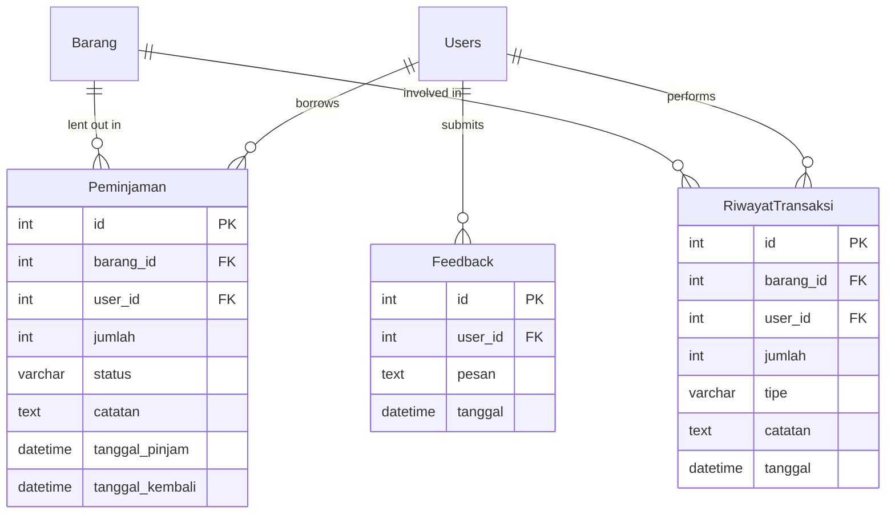

# Class Diagram - Inventory Management System (InvManage)

## System Architecture Overview

The InvManage system follows a layered architecture with clear separation of concerns:
- **Presentation Layer**: HTML/CSS/JavaScript frontend
- **Application Layer**: Django REST Framework API
- **Domain Layer**: Business logic and models
- **Infrastructure Layer**: Database and external services

## Class Diagram

```mermaid
classDiagram
    %% Core Models
    class Users {
        +id: BigAutoField
        +nama: CharField
        +username: CharField?
        +email: EmailField?
        +phone: CharField?
        +password: CharField?
        +role: CharField
        +departemen: CharField?
        +foto: TextField?
        +created_at: DateTimeField
        +updated_at: DateTimeField
        +is_admin: BooleanProperty
        +is_user: BooleanProperty
        +set_password(password)
        +check_password(password)
    }

    class Barang {
        +id: BigAutoField
        +nama: CharField
        +stok: IntegerField
        +harga: IntegerField
        +minimum: IntegerField
        +created_at: DateTimeField
        +updated_at: DateTimeField
        +is_low_stock: BooleanProperty
        +is_out_of_stock: BooleanProperty
        +stock_status: StringProperty
        +save()
    }

    class Peminjaman {
        +id: BigAutoField
        +barang: ForeignKey
        +user: ForeignKey
        +jumlah: IntegerField
        +status: CharField
        +catatan: TextField?
        +tanggal_pinjam: DateTimeField
        +tanggal_kembali: DateTimeField?
        +is_overdue: BooleanProperty
        +days_borrowed: IntegerProperty
    }

    class RiwayatTransaksi {
        +id: BigAutoField
        +barang: ForeignKey
        +user: ForeignKey?
        +jumlah: IntegerField
        +tipe: CharField
        +catatan: TextField?
        +tanggal: DateTimeField
    }

    class Feedback {
        +id: BigAutoField
        +user: ForeignKey
        +pesan: TextField
        +tanggal: DateTimeField
    }

    %% ViewSets (API Controllers)
    class BarangViewSet {
        +queryset: QuerySet
        +serializer_class: BarangSerializer
        +pagination_class: None
        +create(request)
        +update(request, pk)
        +destroy(request, pk)
        +update_stok(request, pk)
        +statistics(request)
        +low_stock(request)
    }

    class UsersViewSet {
        +queryset: QuerySet
        +serializer_class: UsersSerializer
        +pagination_class: None
        +change_password(request, pk)
        +update_foto(request, pk)
    }

    class PeminjamanViewSet {
        +queryset: QuerySet
        +serializer_class: PeminjamanSerializer
        +pagination_class: None
        +throttle_classes: List
        +create(request)
        +partial_update(request, pk)
        +kembalikan(request, pk)
        +active_loans(request)
        +overdue_loans(request)
        +extend_loan(request, pk)
        +manual(request)
        +get_queryset()
    }

    class RiwayatTransaksiViewSet {
        +queryset: QuerySet
        +serializer_class: RiwayatTransaksiSerializer
        +pagination_class: None
    }

    class FeedbackViewSet {
        +queryset: QuerySet
        +serializer_class: FeedbackSerializer
        +pagination_class: None
        +get_queryset()
        +statistics(request)
    }

    %% API Authentication Views
    class login_view {
        +__call__(request)
        -validate_credentials(nama, password)
        -check_user_role(user)
    }

    class register_view {
        +__call__(request)
        -validate_registration_data(data)
        -create_user_with_role(data)
    }

    class admin_login_view {
        +__call__(request)
        -validate_admin_credentials(nama, password)
    }

    class admin_register_view {
        +__call__(request)
        -validate_admin_registration(data)
        -create_admin_user(data)
    }

    class reset_password_view {
        +__call__(request)
        -validate_reset_request(data)
        -update_user_password(user, new_password)
    }

    class google_login_view {
        +__call__(request)
        -verify_google_token(token)
        -create_or_update_user(google_data)
    }

    %% Reporting API Views
    class item_stock_levels {
        +__call__(request)
        -aggregate_stock_data()
        -format_chart_data(data)
    }

    class item_categories {
        +__call__(request)
        -categorize_items()
        -format_pie_chart_data(categories)
    }

    class most_borrowed_items {
        +__call__(request)
        -aggregate_loan_statistics()
        -format_bar_chart_data(stats)
    }

    class item_transaction_trends {
        +__call__(request)
        -aggregate_daily_transactions()
        -format_line_chart_data(trends)
    }

    class low_stock_alerts {
        +__call__(request)
        -find_low_stock_items()
        -format_alert_chart_data(items)
    }

    class item_usage_over_time {
        +__call__(request)
        -aggregate_monthly_loans()
        -format_usage_chart_data(usage)
    }

    class item_status_overview {
        +__call__(request)
        -calculate_stock_status_distribution()
        -format_overview_chart_data(status)
    }

    class reports_dashboard {
        +__call__(request)
        -gather_dashboard_metrics()
        -format_dashboard_data(metrics)
    }

    %% Serializers
    class BarangSerializer {
        +model: Barang
        +fields: List
        +validate_stok(value)
        +validate_harga(value)
        +validate_minimum(value)
    }

    class UsersSerializer {
        +model: Users
        +fields: List
        +password: CharField
        +validate_email(value)
        +validate_username(value)
        +create(validated_data)
        +update(instance, validated_data)
    }

    class PeminjamanSerializer {
        +model: Peminjaman
        +fields: List
        +barang_nama: CharField
        +user_nama: CharField
        +is_overdue: BooleanField
        +days_borrowed: IntegerField
        +validate_jumlah(value)
        +validate(data)
    }

    class RiwayatTransaksiSerializer {
        +model: RiwayatTransaksi
        +fields: List
        +barang_nama: CharField
        +user_nama: CharField
    }

    class FeedbackSerializer {
        +model: Feedback
        +fields: List
        +user_nama: CharField
        +validate_pesan(value)
    }

    %% Utility Classes
    class StandardResultsSetPagination {
        +page_size: int
        +page_size_query_param: str
        +max_page_size: int
    }

    class Cache {
        +get(key)
        +set(key, value, timeout)
        +delete(key)
        +delete_pattern(pattern)
    }

    %% Relationships
    Users ||--o{ Peminjaman : borrows
    Users ||--o{ RiwayatTransaksi : performs
    Users ||--o{ Feedback : submits

    Barang ||--o{ Peminjaman : lent_out
    Barang ||--o{ RiwayatTransaksi : involved_in

    Peminjaman }o--|| Barang : item
    Peminjaman }o--|| Users : borrower

    RiwayatTransaksi }o--|| Barang : item
    RiwayatTransaksi }o--o| Users : user

    Feedback }o--|| Users : submitter

    %% ViewSet to Serializer relationships
    BarangViewSet ..> BarangSerializer : uses
    UsersViewSet ..> UsersSerializer : uses
    PeminjamanViewSet ..> PeminjamanSerializer : uses
    RiwayatTransaksiViewSet ..> RiwayatTransaksiSerializer : uses
    FeedbackViewSet ..> FeedbackSerializer : uses

    %% ViewSet to Model relationships
    BarangViewSet ..> Barang : manages
    UsersViewSet ..> Users : manages
    PeminjamanViewSet ..> Peminjaman : manages
    RiwayatTransaksiViewSet ..> RiwayatTransaksi : manages
    FeedbackViewSet ..> Feedback : manages

    %% Cache relationships
    BarangViewSet ..> Cache : uses
    PeminjamanViewSet ..> Cache : uses

    %% API View relationships
    login_view ..> Users : authenticates
    register_view ..> Users : creates
    admin_login_view ..> Users : authenticates_admin
    admin_register_view ..> Users : creates_admin
    reset_password_view ..> Users : updates_password
    google_login_view ..> Users : oauth_authenticates

    %% Reporting views relationships
    item_stock_levels ..> Barang : reads
    item_categories ..> Barang : analyzes
    most_borrowed_items ..> Peminjaman : aggregates
    item_transaction_trends ..> RiwayatTransaksi : analyzes
    low_stock_alerts ..> Barang : monitors
    item_usage_over_time ..> Peminjaman : trends
    item_status_overview ..> Barang : summarizes
    reports_dashboard ..> Cache : caches_metrics

    %% Frontend Classes (HTML Pages with JavaScript)
    class UserDashboardPage {
        +currentUser: Object
        +init()
        +konfirmasiPinjam(barangId, barangNama)
        +loadAvailableItems()
        +updateDashboardStats()
    }

    class UserPeminjamanPage {
        +currentUser: Object
        +peminjamanList: Array
        +barangList: Array
        +init()
        +loadPeminjamanUser()
        +loadBarangData()
        +submitManualPeminjaman()
        +kembalikanBarang(peminjamanId)
        +extendLoan(peminjamanId)
        +filterPeminjaman(status)
    }

    class UserFeedbackPage {
        +currentUser: Object
        +feedbackList: Array
        +init()
        +loadFeedbackUser()
        +tambahFeedback()
        +loadFeedbackStatistics()
    }

    class AdminDashboardPage {
        +currentUser: Object
        +systemStats: Object
        +init()
        +loadDashboardData()
        +loadChartData()
        +manageUsers()
        +manageItems()
        +viewReports()
    }

    class LoginPage {
        +init()
        +doUserLogin()
        +doAdminLogin()
        +handleGoogleLogin()
        +validateLoginForm()
    }

    class RegisterPage {
        +init()
        +doUserRegister()
        +doAdminRegister()
        +validateRegisterForm()
    }

    %% Utility Classes
    class ApiService {
        +baseUrl: String
        +authToken: String
        +get(endpoint)
        +post(endpoint, data)
        +put(endpoint, data)
        +delete(endpoint)
        +setAuthToken(token)
        +handleResponse(response)
        +handleError(error)
    }

    class AuthService {
        +currentUser: Object
        +isLoggedIn: Boolean
        +login(credentials)
        +logout()
        +register(userData)
        +checkAuthStatus()
        +refreshToken()
    }

    class CacheService {
        +cache: Map
        +set(key, value, ttl)
        +get(key)
        +delete(key)
        +clear()
        +isExpired(key)
    }

    class ValidationService {
        +validateEmail(email)
        +validatePassword(password)
        +validateRequired(value, fieldName)
        +validateNumeric(value, fieldName)
        +validateMinLength(value, minLength, fieldName)
        +showError(message)
        +clearErrors()
    }

    class UIManager {
        +showLoading(element)
        +hideLoading(element)
        +showModal(title, content)
        +hideModal()
        +showToast(message, type)
        +updateTable(tableId, data)
        +populateSelect(selectId, options)
        +toggleVisibility(elementId, show)
    }

    %% Frontend to Backend relationships
    UserDashboardPage ..> ApiService : uses
    UserPeminjamanPage ..> ApiService : uses
    UserFeedbackPage ..> ApiService : uses
    AdminDashboardPage ..> ApiService : uses
    LoginPage ..> AuthService : uses
    RegisterPage ..> AuthService : uses

    ApiService ..> login_view : calls
    ApiService ..> register_view : calls
    ApiService ..> admin_login_view : calls
    ApiService ..> admin_register_view : calls
    ApiService ..> BarangViewSet : calls
    ApiService ..> PeminjamanViewSet : calls
    ApiService ..> FeedbackViewSet : calls
    ApiService ..> UsersViewSet : calls

    AuthService ..> CacheService : uses
    UIManager ..> ValidationService : uses
```

## Detailed Class Specifications

### Core Business Entities

#### Users Model
```python
class Users(models.Model):
    # Authentication fields
    nama = models.CharField(max_length=100, db_index=True)
    username = models.CharField(max_length=100, blank=True, null=True, unique=True)
    email = models.EmailField(blank=True, null=True, unique=True)
    password = models.CharField(max_length=128, blank=True, null=True)

    # Profile fields
    phone = models.CharField(max_length=20, blank=True, null=True)
    role = models.CharField(max_length=10, choices=ROLE_CHOICES, default='user')
    departemen = models.CharField(max_length=100, blank=True, null=True)
    foto = models.TextField(blank=True, null=True)  # Base64 encoded

    # Metadata
    created_at = models.DateTimeField(auto_now_add=True)
    updated_at = models.DateTimeField(auto_now=True)

    # Properties
    @property
    def is_admin(self): return self.role == 'admin'
    @property
    def is_user(self): return self.role == 'user'

    # Methods
    def set_password(self, raw_password): pass
    def check_password(self, raw_password): pass
```

#### Barang (Item) Model
```python
class Barang(models.Model):
    # Core fields
    nama = models.CharField(max_length=100, db_index=True, unique=True)
    stok = models.IntegerField(default=0, validators=[MinValueValidator(0)])
    harga = models.IntegerField(default=0, validators=[MinValueValidator(0)])
    minimum = models.IntegerField(default=5, validators=[MinValueValidator(0)])

    # Metadata
    created_at = models.DateTimeField(auto_now_add=True)
    updated_at = models.DateTimeField(auto_now=True)

    # Properties
    @property
    def is_low_stock(self): return self.stok <= self.minimum
    @property
    def is_out_of_stock(self): return self.stok <= 0
    @property
    def stock_status(self): return 'available' if self.stok > self.minimum else 'low_stock' if self.stok > 0 else 'out_of_stock'
```

#### Peminjaman (Loan) Model
```python
class Peminjaman(models.Model):
    STATUS_CHOICES = [
        ('dipinjam', 'Dipinjam'),
        ('dikembalikan', 'Dikembalikan'),
    ]

    # Relationships
    barang = models.ForeignKey(Barang, on_delete=models.CASCADE, related_name='peminjaman')
    user = models.ForeignKey(Users, on_delete=models.CASCADE, related_name='peminjaman')

    # Loan details
    jumlah = models.IntegerField(validators=[MinValueValidator(1)])
    status = models.CharField(max_length=15, choices=STATUS_CHOICES, default='dipinjam')
    catatan = models.TextField(blank=True, null=True)

    # Dates
    tanggal_pinjam = models.DateTimeField(auto_now_add=True)
    tanggal_kembali = models.DateTimeField(null=True, blank=True)

    # Properties
    @property
    def is_overdue(self):
        if self.status == 'dipinjam':
            return self.tanggal_pinjam < timezone.now() - timedelta(days=7)
        return False

    @property
    def days_borrowed(self):
        if self.tanggal_kembali:
            return (self.tanggal_kembali - self.tanggal_pinjam).days
        return (timezone.now() - self.tanggal_pinjam).days
```

### API Layer (ViewSets)

#### BarangViewSet - Complete CRUD with Business Logic
```python
class BarangViewSet(viewsets.ModelViewSet):
    queryset = Barang.objects.all()
    serializer_class = BarangSerializer
    pagination_class = None

    def create(self, request, *args, **kwargs):
        # Custom validation and cache management
        pass

    def update(self, request, *args, **kwargs):
        # Business logic for updates
        pass

    def destroy(self, request, *args, **kwargs):
        # Safety checks before deletion
        pass

    @action(detail=True, methods=['post'])
    def update_stok(self, request, pk=None):
        # Stock management with transaction logging
        pass
```

#### PeminjamanViewSet - Advanced Loan Management
```python
class PeminjamanViewSet(viewsets.ModelViewSet):
    queryset = Peminjaman.objects.all()
    serializer_class = PeminjamanSerializer
    pagination_class = None
    throttle_classes = [UserRateThrottle, AnonRateThrottle]

    def get_queryset(self):
        """Advanced filtering with query parameters"""
        queryset = Peminjaman.objects.select_related('barang', 'user').order_by('-tanggal_pinjam')
        user_id = self.request.query_params.get('user')
        status_filter = self.request.query_params.get('status')
        overdue = self.request.query_params.get('overdue')

        if user_id:
            queryset = queryset.filter(user_id=user_id)
        if status_filter:
            queryset = queryset.filter(status=status_filter)
        if overdue == 'true':
            seven_days_ago = timezone.now() - timedelta(days=7)
            queryset = queryset.filter(status='dipinjam', tanggal_pinjam__lt=seven_days_ago)

        return queryset

    def create(self, request, *args, **kwargs):
        """Create loan with comprehensive validation"""
        # Validate stock availability
        # Reduce stock automatically
        # Create transaction log
        # Return formatted loan data
        pass

    def partial_update(self, request, *args, **kwargs):
        """Update loan with stock reconciliation"""
        # Handle status changes (borrowed -> returned)
        # Automatically adjust stock levels
        # Update return date for returned items
        # Handle quantity modifications
        pass

    @action(detail=True, methods=['post'])
    def kembalikan(self, request, pk=None):
        """Return item with stock restoration"""
        # Validate loan exists and is active
        # Restore stock to inventory
        # Create return transaction record
        # Set return timestamp
        # Clear related cache entries
        pass

    @action(detail=False, methods=['get'])
    def active_loans(self, request):
        """Retrieve active loans for user or all users"""
        user_id = request.query_params.get('user_id')
        queryset = self.get_queryset().filter(status='dipinjam')
        if user_id:
            queryset = queryset.filter(user_id=user_id)
        serializer = self.get_serializer(queryset, many=True)
        return Response(serializer.data)

    @action(detail=False, methods=['get'])
    def overdue_loans(self, request):
        """Get all loans past due date (7+ days)"""
        seven_days_ago = timezone.now() - timedelta(days=7)
        queryset = self.get_queryset().filter(
            status='dipinjam',
            tanggal_pinjam__lt=seven_days_ago
        )
        serializer = self.get_serializer(queryset, many=True)
        return Response(serializer.data)

    @action(detail=True, methods=['post'])
    def extend_loan(self, request, pk=None):
        """Extend loan duration with validation"""
        # Verify loan is active and not overdue
        # Add extension marker to notes
        # Return success confirmation
        pass

    @action(detail=False, methods=['post'])
    def manual(self, request):
        """Create manual loan entry (admin/special cases)"""
        # Delegate to standard create method
        return self.create(request)
```

### Data Transfer Objects (Serializers)

#### BarangSerializer - Validation & Data Transformation
```python
class BarangSerializer(serializers.ModelSerializer):
    status = serializers.ReadOnlyField()
    is_low_stock = serializers.ReadOnlyField()
    is_out_of_stock = serializers.ReadOnlyField()
    stock_status = serializers.ReadOnlyField()

    class Meta:
        model = Barang
        fields = ['id', 'nama', 'stok', 'harga', 'minimum', 'status',
                 'is_low_stock', 'is_out_of_stock', 'stock_status']

    def validate_stok(self, value):
        if value < 0:
            raise serializers.ValidationError("Stock cannot be negative")
        return value

    def validate_harga(self, value):
        if value < 0:
            raise serializers.ValidationError("Price cannot be negative")
        return value

    def validate_minimum(self, value):
        if value < 0:
            raise serializers.ValidationError("Minimum stock cannot be negative")
        return value
```

## Database Relationships

### Entity-Relationship Diagram (ERD)



## Design Patterns Implemented

### 1. Repository Pattern
- **ViewSets** act as repositories for data access
- **QuerySets** provide abstracted data access
- **Select_related/Prefetch_related** for optimized queries

### 2. Service Layer Pattern
- **Custom methods** in ViewSets handle business logic
- **Transaction management** for data consistency
- **Cache management** for performance

### 3. Data Transfer Object (DTO) Pattern
- **Serializers** transform data between layers
- **Validation** at API boundaries
- **Field-level permissions** and transformations

### 4. Observer Pattern
- **Signals** for model changes (if implemented)
- **Cache invalidation** on data changes
- **Audit logging** for transactions

## Security & Validation

### Input Validation
- **Serializer-level validation** for all inputs
- **Model-level constraints** for data integrity
- **Custom validators** for business rules

### Access Control
- **Role-based permissions** (Admin/User/Guest)
- **Object-level permissions** for data access
- **API throttling** to prevent abuse

### Data Protection
- **SQL injection prevention** via ORM
- **XSS protection** via input sanitization
- **CSRF protection** via tokens

## Performance Optimizations

### Database Level
- **Indexes** on frequently queried fields
- **Foreign key constraints** for referential integrity
- **Query optimization** with select_related/prefetch_related

### Application Level
- **Caching strategy** with multiple cache keys
- **Pagination control** (disabled for frontend compatibility)
- **Lazy loading** for related data

### Infrastructure Level
- **Database connection pooling**
- **Gunicorn/UWSGI** for production deployment
- **Nginx/Apache** for static file serving