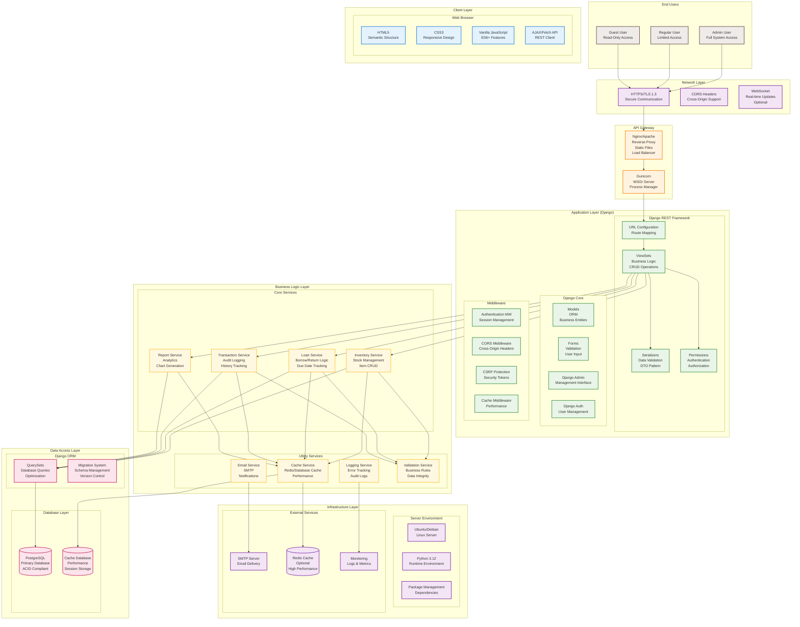

# Web Architecture - Inventory Management System (InvManage)

## System Overview

InvManage is a modern web-based inventory management system built with Django REST Framework backend and vanilla JavaScript frontend, designed for scalability, performance, and maintainability.

## Complete System Architecture



## Detailed Component Architecture

### 1. Client Layer Architecture

#### Frontend Structure
```
frontend/
├── index.html          # Landing page
├── dashboard.html      # Main dashboard
├── admin-login.html    # Admin authentication
├── app.js             # Main application logic
├── script.js          # Additional functionality
├── style.css          # Styling
└── assets/            # Static assets
```

#### JavaScript Architecture
```javascript
// Modular JavaScript Structure
const InvManage = {
    // API Client
    api: {
        baseURL: 'http://localhost:8001/api',
        login: async (credentials) => { /* ... */ },
        getItems: async () => { /* ... */ },
        // ... other API methods
    },

    // UI Components
    ui: {
        dashboard: {
            init: () => { /* ... */ },
            renderCharts: () => { /* ... */ },
            updateStats: () => { /* ... */ }
        },
        inventory: {
            loadItems: () => { /* ... */ },
            addItem: () => { /* ... */ },
            editItem: () => { /* ... */ }
        }
    },

    // Business Logic
    business: {
        validateItem: (item) => { /* ... */ },
        calculateStats: (data) => { /* ... */ }
    },

    // Utilities
    utils: {
        formatDate: (date) => { /* ... */ },
        showNotification: (message) => { /* ... */ }
    }
};
```

### 2. Application Layer Architecture

#### Django Project Structure
```
invmanage-backend/
├── invmanage/              # Django project settings
│   ├── settings.py        # Configuration
│   ├── urls.py           # URL routing
│   ├── wsgi.py           # WSGI application
│   └── asgi.py           # ASGI application
├── api/                   # Main application
│   ├── models.py         # Database models
│   ├── views.py          # API endpoints
│   ├── serializers.py    # Data serialization
│   ├── urls.py           # API routing
│   ├── admin.py          # Django admin
│   ├── apps.py           # App configuration
│   ├── tests.py          # Unit tests
│   └── migrations/       # Database migrations
├── docs/                  # Documentation
├── requirements.txt       # Dependencies
├── manage.py             # Django management
└── db.sqlite3            # Development database
```

#### API Endpoint Architecture
```python
# URL Configuration Structure
urlpatterns = [
    # Authentication
    path('api/admin/login/', admin_login_view),
    path('api/login/', login_view),
    path('api/register/', register_view),

    # CRUD Endpoints
    path('api/', include(router.urls)),  # ViewSet routes

    # Reporting
    path('api/reports/dashboard/', reports_dashboard),
    path('api/reports/item-stock-levels/', item_stock_levels),
    # ... other report endpoints
]

# Router Configuration
router = DefaultRouter()
router.register(r'barang', BarangViewSet)
router.register(r'users', UsersViewSet)
router.register(r'peminjaman', PeminjamanViewSet)
router.register(r'transaksi', RiwayatTransaksiViewSet)
router.register(r'feedback', FeedbackViewSet)
```

### 3. Data Layer Architecture

#### Database Schema Design
```sql
-- Core Tables
CREATE TABLE api_users (
    id BIGSERIAL PRIMARY KEY,
    nama VARCHAR(100) NOT NULL,
    email VARCHAR(254) UNIQUE,
    password VARCHAR(128),
    role VARCHAR(10) DEFAULT 'user',
    created_at TIMESTAMP DEFAULT NOW()
);

CREATE TABLE api_barang (
    id BIGSERIAL PRIMARY KEY,
    nama VARCHAR(100) UNIQUE NOT NULL,
    stok INTEGER DEFAULT 0 CHECK (stok >= 0),
    harga INTEGER DEFAULT 0 CHECK (harga >= 0),
    minimum INTEGER DEFAULT 5 CHECK (minimum >= 0)
);

CREATE TABLE api_peminjaman (
    id BIGSERIAL PRIMARY KEY,
    barang_id BIGINT REFERENCES api_barang(id),
    user_id BIGINT REFERENCES api_users(id),
    jumlah INTEGER CHECK (jumlah > 0),
    status VARCHAR(15) DEFAULT 'dipinjam',
    tanggal_pinjam TIMESTAMP DEFAULT NOW(),
    tanggal_kembali TIMESTAMP
);

-- Indexes for Performance
CREATE INDEX idx_users_nama ON api_users(nama);
CREATE INDEX idx_users_role ON api_users(role);
CREATE INDEX idx_barang_nama ON api_barang(nama);
CREATE INDEX idx_peminjaman_status ON api_peminjaman(status);
CREATE INDEX idx_peminjaman_tanggal ON api_peminjaman(tanggal_pinjam);
```

#### Caching Architecture
```python
# Cache Configuration
CACHES = {
    'default': {
        'BACKEND': 'django.core.cache.backends.db.DatabaseCache',
        'LOCATION': 'django_cache_table',
    }
}

# Cache Key Strategy
CACHE_KEYS = {
    'dashboard': 'reports_dashboard',
    'item_status': 'reports_item_status_overview',
    'stock_levels': 'reports_item_stock_levels',
    'user_stats': 'user_statistics',
    'item_details': lambda item_id: f'item_{item_id}'
}

# Cache TTL Strategy
CACHE_TIMEOUTS = {
    'dashboard': 180,      # 3 minutes
    'reports': 600,        # 10 minutes
    'statistics': 300,     # 5 minutes
    'user_data': 3600,     # 1 hour
}
```

### 4. Security Architecture

#### Authentication & Authorization
```python
# Permission Classes
class IsAdminOrReadOnly(permissions.BasePermission):
    def has_permission(self, request, view):
        if request.method in permissions.SAFE_METHODS:
            return True
        return request.user and request.user.is_staff

class IsOwnerOrAdmin(permissions.BasePermission):
    def has_object_permission(self, request, view, obj):
        if request.user and request.user.is_staff:
            return True
        return obj.user == request.user
```

#### Security Middleware Stack
```python
MIDDLEWARE = [
    'django.middleware.security.SecurityMiddleware',
    'corsheaders.middleware.CorsMiddleware',
    'django.contrib.sessions.middleware.SessionMiddleware',
    'django.middleware.common.CommonMiddleware',
    'django.middleware.csrf.CsrfViewMiddleware',
    'django.contrib.auth.middleware.AuthenticationMiddleware',
    'django.contrib.messages.middleware.MessageMiddleware',
    'django.middleware.clickjacking.XFrameOptionsMiddleware',
]
```

### 5. Deployment Architecture

#### Production Deployment
```yaml
# Docker Compose Configuration
version: '3.8'
services:
  web:
    build: .
    command: gunicorn invmanage.wsgi:application --bind 0.0.0.0:8000
    volumes:
      - .:/code
      - static_volume:/code/static
    expose:
      - 8000
    environment:
      - DJANGO_SETTINGS_MODULE=invmanage.settings.production

  nginx:
    image: nginx:alpine
    volumes:
      - ./nginx.conf:/etc/nginx/nginx.conf
      - static_volume:/code/static
    ports:
      - "80:80"
      - "443:443"

  db:
    image: postgres:15
    environment:
      - POSTGRES_DB=invmanage
      - POSTGRES_USER=invmanage_user
      - POSTGRES_PASSWORD=secure_password
    volumes:
      - postgres_data:/var/lib/postgresql/data

volumes:
  postgres_data:
  static_volume:
```

#### Environment Configuration
```python
# settings/production.py
import os
from .base import *

DEBUG = False
SECRET_KEY = os.environ.get('DJANGO_SECRET_KEY')

DATABASES = {
    'default': {
        'ENGINE': 'django.db.backends.postgresql',
        'NAME': os.environ.get('DB_NAME'),
        'USER': os.environ.get('DB_USER'),
        'PASSWORD': os.environ.get('DB_PASSWORD'),
        'HOST': os.environ.get('DB_HOST'),
        'PORT': os.environ.get('DB_PORT', 5432),
    }
}

CACHES = {
    'default': {
        'BACKEND': 'django.core.cache.backends.redis.RedisCache',
        'LOCATION': os.environ.get('REDIS_URL'),
    }
}
```

## Performance & Scalability

### Caching Strategy
- **Database Cache**: For development/simple deployments
- **Redis Cache**: For production/high-traffic scenarios
- **CDN**: For static assets in production
- **Browser Cache**: For frontend assets

### Database Optimization
- **Connection Pooling**: PgBouncer for PostgreSQL
- **Read Replicas**: For read-heavy workloads
- **Indexing Strategy**: Composite indexes for complex queries
- **Query Optimization**: Select related/prefetch related

### Monitoring & Observability
```python
# Logging Configuration
LOGGING = {
    'version': 1,
    'disable_existing_loggers': False,
    'handlers': {
        'file': {
            'level': 'INFO',
            'class': 'logging.FileHandler',
            'filename': 'logs/django.log',
        },
        'console': {
            'level': 'DEBUG',
            'class': 'logging.StreamHandler',
        },
    },
    'loggers': {
        'django': {
            'handlers': ['file', 'console'],
            'level': 'INFO',
            'propagate': True,
        },
        'api': {
            'handlers': ['file'],
            'level': 'DEBUG',
            'propagate': False,
        },
    },
}
```

## API Documentation

### REST API Endpoints

#### Authentication Endpoints
```
POST   /api/admin/login/     - Admin login
POST   /api/login/          - User login
POST   /api/register/       - User registration
POST   /api/reset-password/ - Password reset
```

#### CRUD Endpoints
```
GET    /api/barang/         - List items
POST   /api/barang/         - Create item
GET    /api/barang/{id}/    - Get item details
PUT    /api/barang/{id}/    - Update item
DELETE /api/barang/{id}/    - Delete item
POST   /api/barang/{id}/update_stok/ - Update stock
```

#### Reporting Endpoints
```
GET    /api/reports/dashboard/              - Dashboard data
GET    /api/reports/item-stock-levels/      - Stock levels chart
GET    /api/reports/item-categories/        - Categories chart
GET    /api/reports/most-borrowed-items/    - Popular items chart
GET    /api/reports/item-transaction-trends/ - Transaction trends
GET    /api/reports/low-stock-alerts/       - Low stock alerts
```

## Data Flow Architecture

### Request Flow
1. **Client Request** → HTTPS → Nginx → Gunicorn
2. **URL Resolution** → ViewSet → Serializer → Model
3. **Business Logic** → Service Layer → Cache Check
4. **Database Query** → ORM → PostgreSQL
5. **Response** ← Serialization ← ViewSet ← Gunicorn

### Cache Flow
1. **Request** → Check Cache → Cache Hit? → Return Cached Data
2. **Cache Miss** → Database Query → Process Data → Store in Cache → Return Data

### Authentication Flow
1. **Login Request** → Validate Credentials → Generate Session
2. **API Request** → Check Session → Authorize → Process Request
3. **Logout** → Destroy Session → Clear Cache

This architecture provides a scalable, secure, and maintainable foundation for the inventory management system with clear separation of concerns and comprehensive documentation.